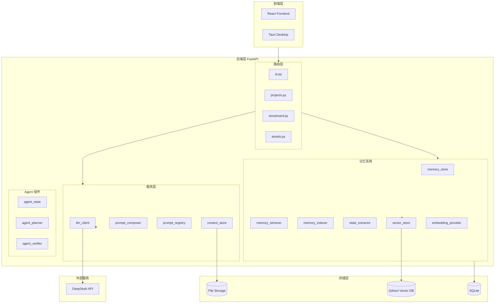
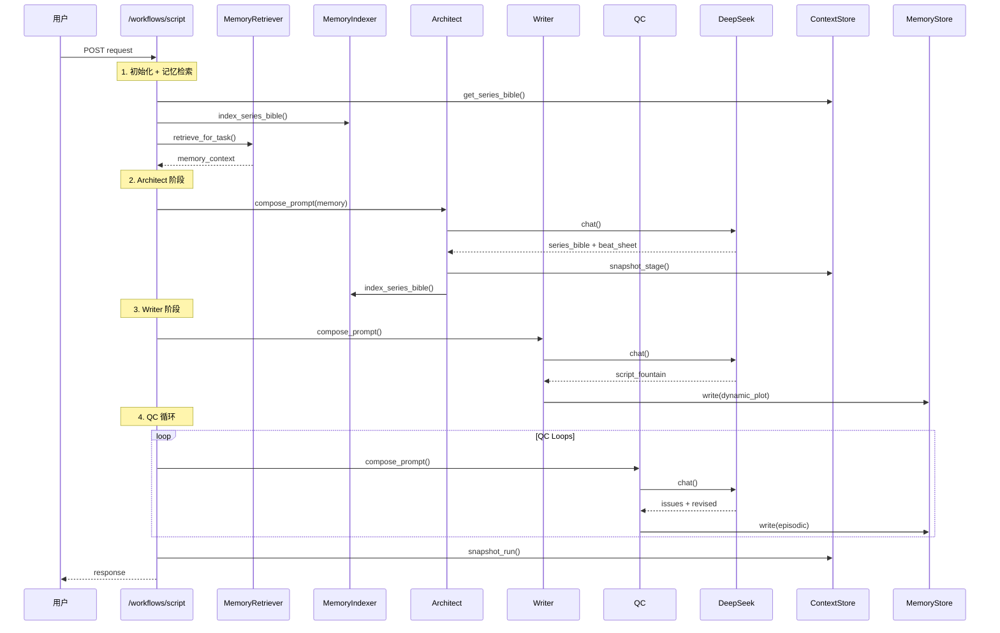
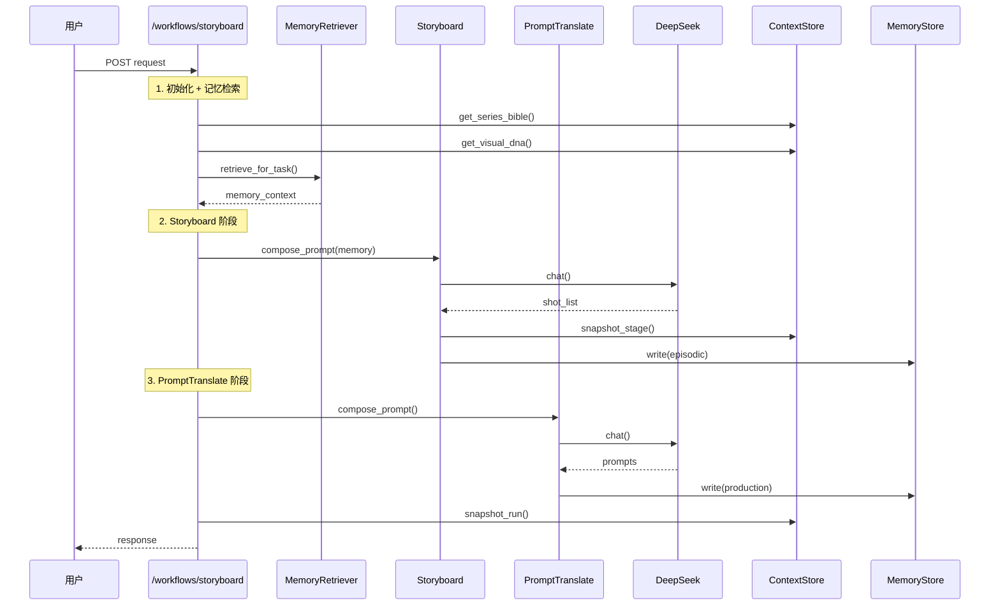

# AI 漫剧多代理 Workflows（后端统一编排）代码设计文档

## 系统整体架构



---

## 背景与目标

本项目现有后端已具备：
- 剧本骨架数据模型：`Project -> Episode -> Scene -> Shot`
- 原子 AI 能力：分场/分镜/大纲优化/剧本生成（`/ai/*`）
- 可编辑 Prompt 模板（`prompt_templates.json` 覆盖内置模板）

结合以下文档思想：
- `docs/剧本代理层示例讲解.md`：多代理分层（架构师/编剧/监理/QC/分镜师）
- `docs/AI 漫剧创作 Prompt 指导原则.md`：格式即法律、负向约束、受控词汇、元认知自检循环
- `docs/JSON一致性优化.md`：JSON 作为一致性中间层（Visual DNA/技术参数/标签串）

我们将 AI 能力从“单次调用 + 文本输出”升级为：
- **后端统一编排的 workflow**：多次 LLM 调用串联，产出可审计的结构化中间产物
- **file-first 的一致性上下文（Context）**：Series Bible / Visual DNA / run 快照
- **模块化 Prompt 组装**：role + context + constraints + instruction + output_format

## 非目标（阶段性不做）
- ~~不做“图片→JSON”视觉识别（当前 LLM 接口为纯 chat；后续可抽象 vision provider）~~ ✅ **已实现**（见 `docs/architecture/workflow-implementation.md` Phase 3）
- ~~不强制把 workflow 结果自动写入数据库 Episode/Scene/Shot（先返回给前端 + 落 runs 快照；后续再做 Apply-to-DB）~~ ✅ **已实现**（见 `docs/architecture/workflow-implementation.md` Phase 0）

---

## 代码结构与模块边界

### Services（可复用底座）

- `backend/app/services/app_paths.py`
  - 统一路径约定：`data_dir()` / `app_data_dir()` / `ai_settings_path()` / `prompt_templates_path()`
  - 项目级目录：`projects/{project_id}/context`、`projects/{project_id}/runs`

- `backend/app/services/llm_client.py`
  - `DeepSeekChatClient.chat(settings, messages)`：统一 DeepSeek(OpenAI兼容) chat 调用与错误透出
  - `LlmChatSettings`：base_url / api_key / model / temperature / max_tokens / timeout_seconds

- `backend/app/services/prompt_registry.py`
  - 内置模板 + 覆盖文件合并：`prompt_templates.json`
  - 关键函数：
    - `get_template_prompt(key, variables?)`
    - `render_template_with_validation(key, variables?) -> (prompt, missing_vars)`
    - `list_templates_read()`：给前端模板管理 UI
  - 新增 workflow 模板 keys：
    - `architect_system` / `writer_system` / `qc_system`
    - `storyboard_system` / `prompt_translate_system` / `prompt_translate_mj_system`
    - `visual_dna_ingest_system`

- `backend/app/services/prompt_composer.py`
  - `PromptModules`：role_definition / series_bible / constraints / instruction / output_format / extra_blocks
  - `compose_system_prompt_xml(modules)`：输出 XML wrapper（可读、稳定、便于模型遵循）

- `backend/app/services/context_store.py`
  - file-first 存储：
    - `series_bible.v1.json`
    - `visual_dna.asset_item_{item_id}.v1.json`
    - 每次 workflow：`runs/{run_id}/{request,response,meta}.json`
    - 每个 stage：`runs/{run_id}/stages/{stage_name}.json`
  - `snapshot_run()`：落盘可审计输入输出
  - `snapshot_stage()`：落盘每个 stage 的中间产物
  - `list_runs()` / `read_run()` / `list_stages()` / `read_stage()`：浏览和审计功能

### 记忆系统（Memory System）

- `backend/app/services/embedding_provider.py`
  - 本地 Embedding 模型封装（BAAI/bge-m3）
  - CPU 优先，使用 SentenceTransformers

- `backend/app/services/vector_store.py`
  - Qdrant 向量数据库封装
  - 支持 upsert、search、filter、MMR

- `backend/app/services/memory_store.py`
  - 记忆存储核心（整合 Vector + SQLite）
  - 支持写入、检索、冲突检测
  - 分层检索（L0/L1/L2）

- `backend/app/services/memory_indexer.py`
  - 将 SeriesBible/VisualDNA 原子化切片并索引
  - 保留原 JSON 文件为真理源

- `backend/app/services/memory_retriever.py`
  - 查询分解、分层检索、冲突检测
  - 格式化检索结果供 Prompt 注入

- `backend/app/services/state_extractor.py`
  - 从 LLM 输出提取状态变更
  - 写入 Episodic 记忆

### Agent 组件

- `backend/app/workflows/agent_state.py`
  - 统一 AgentState：messages、working_set、retrieved_memories、actions_taken

- `backend/app/services/agent_planner.py`
  - 规划检索策略、任务分解

- `backend/app/services/agent_verifier.py`
  - 基于规则和记忆的硬校验

---

## Context（file-first）规范

### 存储位置（不暴露给 `/files`）

`/files` 只挂载 `data_dir()`，因此我们把内部上下文放在 `app_data_dir()`（data 的父目录）：

- `app_data_dir/ai_settings.json`
- `app_data_dir/prompt_templates.json`
- `app_data_dir/projects/{project_id}/context/series_bible.v1.json`
- `app_data_dir/projects/{project_id}/context/visual_dna.asset_item_{item_id}.v1.json`
- `app_data_dir/projects/{project_id}/runs/{run_id}/request.json`
- `app_data_dir/projects/{project_id}/runs/{run_id}/response.json`
- `app_data_dir/projects/{project_id}/runs/{run_id}/meta.json`

### 版本策略

当前采用 **文件名版本**（`v1`）：
- 读取默认 `v1`
- 后续可扩展为 `v2` 并通过 API 显式指定 `version`

---

## API 设计

### 1) Context 管理 API

#### 获取 Series Bible
- `GET /ai/context/series-bible?project_id=1&version=v1`
- Response：`{ project_id, kind:\"series_bible\", version, exists, data }`

#### 写入 Series Bible
- `PUT /ai/context/series-bible?project_id=1`
- Body：`{ data: {...}, version: \"v1\" }`
- Response：`{ project_id, kind, version, path, updated_at_ms }`

#### 获取 / 写入 Visual DNA
- `GET /ai/context/visual-dna?project_id=1&item_id=10&version=v1`
- `PUT /ai/context/visual-dna?project_id=1&item_id=10`

> Visual DNA 的 `item_id` 对应当前“资产条目（asset-items）”，即 `Character` 表记录。

### 2) Workflow：剧本（script）

- `POST /ai/workflows/script`
- Request：
  - `project_id`
  - `input_text`（大纲/章节/需求）
  - `options`：
    - `qc_loops`：QC 迭代次数（0~5）
    - `max_scenes`：派生分场上限
    - `derived_split_scenes`：是否额外分场
- Response：
  - `run_id`
  - `series_bible`（object）
  - `beat_sheet`（array）
  - `script_fountain`（string）
  - `qc_report`（object）
  - `derived`（可选，包含 scenes）

工作流步骤：
1. ArchitectAgent：生成 `series_bible + beat_sheet`（严格 JSON）
2. WriterAgent：基于 `series_bible + beat_sheet` 生成 `script_fountain`（严格 JSON）
3. QCAgent：检查并可修订 `script_fountain`（严格 JSON，支持循环）
4. （可选）SplitScenes：从最终 `script_fountain` 派生场列表
5. 落盘：`runs/{run_id}` 快照

**数据流转图**：



**记忆系统集成**：
- **检索时机**：Architect 阶段开始前，检索已有设定和约束
- **写入时机**：
  - Architect 完成：重新索引 SeriesBible
  - Writer 完成：写入 dynamic_plot（章节摘要）
  - 每轮 QC：写入 episodic（修订原因）

**前端集成**：✅ 已实现（`ScriptPage.tsx` 中的 `handleWorkflowScript` 和 `handleApplyWorkflowScript`）

### 3) Workflow：分镜 + 提示词（storyboard）

- `POST /ai/workflows/storyboard`
- Request：
  - `project_id`
  - `scene_text`
  - `options`：
    - `max_shots`
    - `asset_item_ids`：用于锁定视觉 DNA（从 context 读取）
    - `prompt_style`：`"sd_tags"` | `"mj_v6"`（新增）
    - `aspect_ratio`：如 `"16:9"`（新增，仅 MJ v6 模式）
- Response：
  - `run_id`
  - `shots`：镜头列表（包含 prompt/negative_prompt）

工作流步骤：
1. StoryboardAgent：输出镜头结构（ShotSpec 列表，严格 JSON）
2. PromptTranslateAgent：根据 `prompt_style` 选择模板，为每个镜头生成对应风格的 `prompt/negative_prompt`（严格 JSON）
   - `sd_tags`：SD/Flux tags 风格（逗号分隔）
   - `mj_v6`：Midjourney v6 风格（自然语言，`::` 分隔符，含 `--ar`、`--v 6.0`、`--stylize 250`）
3. 合并输出并落盘快照

**数据流转图**：



**记忆系统集成**：
- **检索时机**：Storyboard 阶段开始前，重点检索 character_design（角色视觉设计）
- **写入时机**：
  - Storyboard 完成：写入 episodic（镜头状态变更）
  - PromptTranslate 完成：写入 production（prompt 样例）

**前端集成**：✅ 已实现（`ScriptPage.tsx` 中的 `handleWorkflowStoryboard` 和 `handleApplyWorkflowStoryboard`，含 prompt style 选择器）

---

## 记忆系统分层

| 层级 | 命名空间 | 内容 | 存储 | 读写频率 |
|------|----------|------|------|----------|
| L0 Buffer | AgentState.messages | 当前对话历史 | 内存 | 高频读写 |
| L1 Episodic | episodic | 状态变更、事件 | SQLite + Vector | 写多读少 |
| L2 Static | static_bible | 世界观、角色设定 | Vector | 低频写、高频读 |
| L2 Dynamic | dynamic_plot | 剧情进展、关系演化 | Vector | 中频读写 |
| Negative | world_rules_negative | 禁忌、约束 | Vector | 每次必读 |
| Production | production | Prompt 样例 | Vector | 低频写、按需读 |

---

## Prompt 模板与可定制点

### 模板文件

`prompt_templates.json` 的结构保持为：

```json
{
  "templates": {
    "split_scenes_system": { "title": "...", "category": "...", "prompt": "...", "variables": ["max_scenes"] }
  }
}
```

### 关键 keys

- 原子能力：`split_scenes_system`、`split_shots_system`、`outline_optimize_system`、`script_generate_system`
- Workflows：`architect_system`、`writer_system`、`qc_system`、`storyboard_system`、`prompt_translate_system`

workflow 的 system prompt 最终由 `PromptComposer` 组装，模板内容主要充当 `role_definition`（角色与风格锚点），而 “格式即法律/输出 schema” 由 composer 的 `constraints/instruction` 强约束。

---

## Run 快照（审计与可复现）

每次 workflow 会写入：
- `request.json`：原始输入（含 options）
- `response.json`：最终输出（含 run_id）
- `meta.json`：`{ project_id, run_id, created_at_ms, workflow }`
- `stages/{stage_name}.json`：每个 stage 的中间产物（✅ 已实现）

**审计 API**：✅ 已实现
- `GET /ai/runs-files?project_id=...` - 列出所有 runs
- `GET /ai/runs-files/{run_id}?project_id=...` - 读取完整 run
- `GET /ai/runs-files/{run_id}/stages?project_id=...` - 列出所有 stages
- `GET /ai/runs-files/{run_id}/stages/{stage_name}?project_id=...` - 读取指定 stage

**前端页面**：✅ 已实现（`RunInspectorPage.tsx`，路由 `/runs`）

---

## 迁移与兼容

### 对现有前端的影响
- 原子 API (`/ai/split-scenes` 等) **保持不变**
- 前端可渐进式接入 workflows：先使用 `/ai/workflows/script` 拿到 `script_fountain/beat_sheet` 再写回 DB

### 对现有后端的影响
- `backend/app/routers/ai.py` 已复用 services（LLM client / prompt registry / json extract）
- 新增 endpoints 不影响旧 endpoints（兼容优先）

---

## 错误处理与限流策略（当前实现）

- 未配置 API Key：`400 AI API Key 未配置`
- LLM 输出不符合 schema：`422`（自动修复一次，失败则返回错误）
- `qc_loops` 做上限保护：最多 5 次（避免失控的成本/时间）
- `asset_item_ids` 上限 50（避免 prompt 过长）
- Context 版本格式校验：`v\d+`（如 `v1`、`v2`）
- Visual DNA 摄取文件路径校验：必须在 `/files` 目录下

## 新增功能（实现状态）

✅ **已实现**（详见 `docs/architecture/workflow-implementation.md`）：
- Phase 0: 前端 Workflow 集成（ScriptPage 的 handler 函数）
- Phase 1: Context 管理 UI（ContextPage，路由 `/context`）
- Phase 2: Run 快照审计（RunInspectorPage，路由 `/runs`）
- Phase 3: Visual DNA 摄取（`POST /ai/visual-dna/ingest`）
- Phase 4: 多平台提示词方言（SD tags / Midjourney v6）

## 原子 API 记忆集成

原子 AI API 支持可选的 `project_id` 参数启用记忆检索：

| API | 记忆检索 | 说明 |
|-----|----------|------|
| `POST /ai/outline-generate` | ✅ | 检索世界观、历史剧情 |
| `POST /ai/outline-optimize` | ✅ | 检索世界观、历史剧情 |
| `POST /ai/generate-script` | ✅ | 检索更多历史剧情（15条） |
| `POST /ai/script-optimize` | ✅ | 检索世界观、历史剧情 |
| `POST /ai/split-scenes` | - | 不需要记忆 |
| `POST /ai/split-shots` | - | 不需要记忆 |

**使用方式**：
```json
{
  "text": "...",
  "project_id": 1  // 可选：启用记忆检索
}
```

---

## 文件存储结构

```
{app_data_dir}/
├── ai_settings.json
├── prompt_templates.json
├── memory_store.db                       # SQLite（episodic 记忆）
├── qdrant/                               # 向量数据库
└── projects/{project_id}/
    ├── context/
    │   ├── series_bible.v1.json
    │   └── visual_dna.asset_item_{id}.v1.json
    └── runs/{run_id}/
        ├── request.json
        ├── response.json
        ├── meta.json
        └── stages/
            ├── architect.raw.json
            ├── architect.parsed.json
            └── ...
```

---

## 相关文档

- [Workflow 功能实现文档](./workflow-implementation.md) - 详细的功能实现说明
- [记忆系统实现总结](./memory-system-summary.md) - 记忆系统实现状态
- [记忆系统实现文档](./memory-system-implementation.md) - 记忆系统详细设计
- [记忆系统集成完成](./memory-integration-complete.md) - 集成说明和 API 变更
- [JSON 一致性优化](../JSON一致性优化.md) - Visual DNA 的设计理念
- [AI 漫剧创作 Prompt 指导原则](../AI%20漫剧创作%20Prompt%20指导原则.md) - Prompt 工程最佳实践


