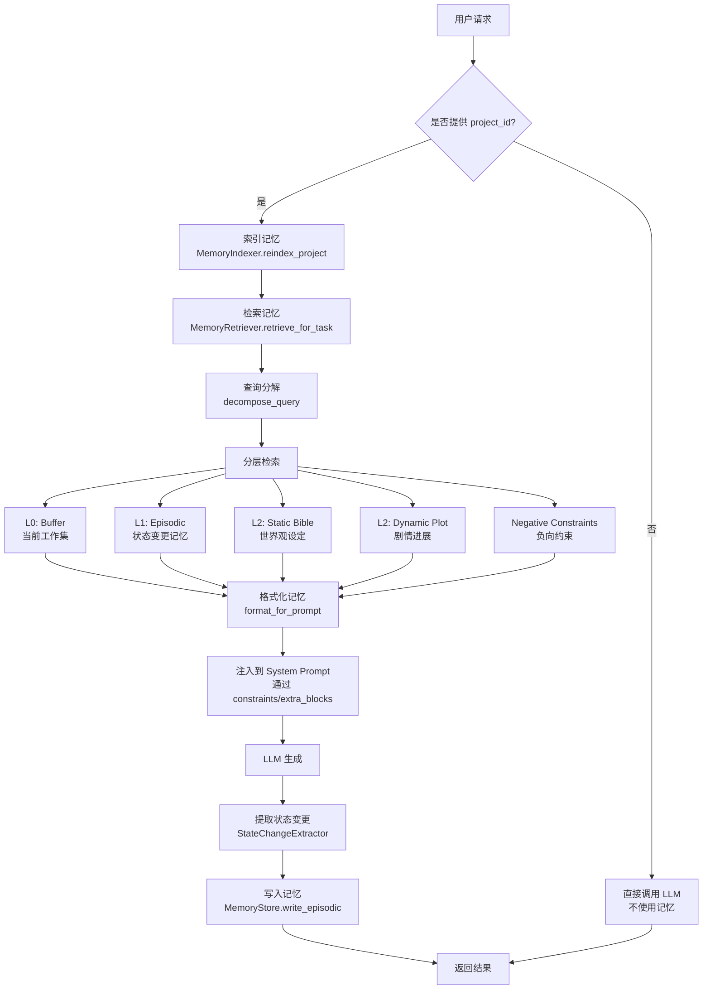
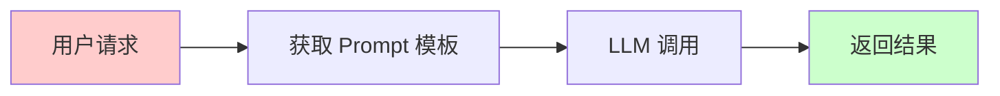
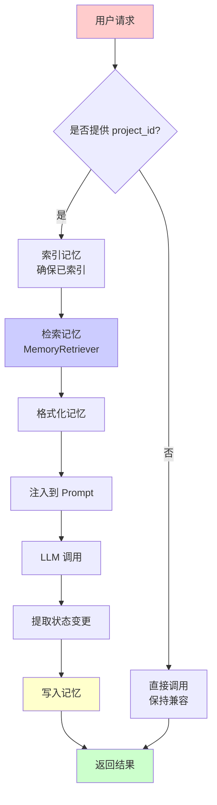
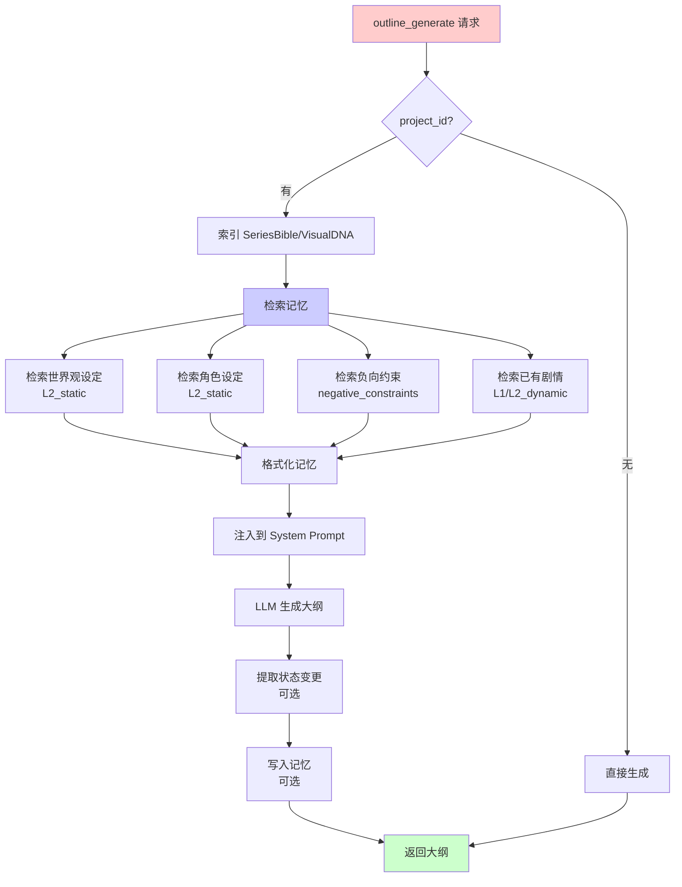
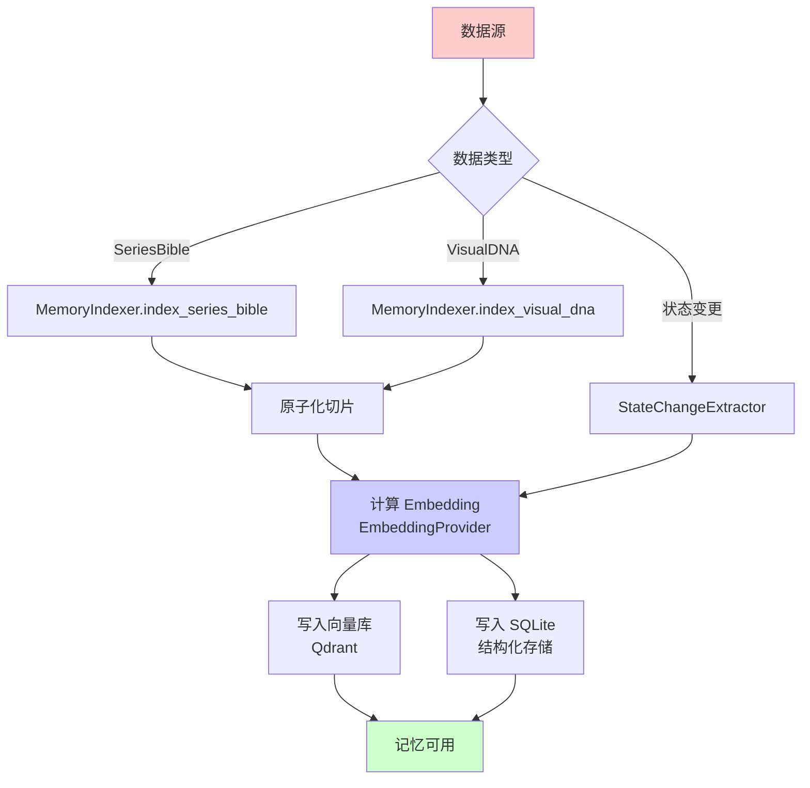
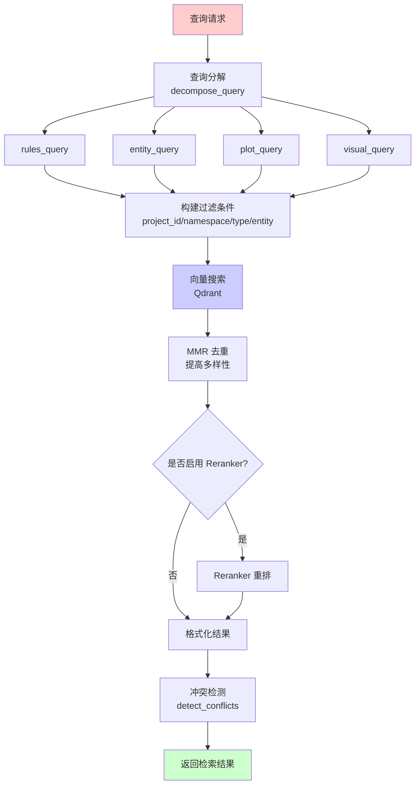

# 记忆系统工作流程图

## 一、记忆系统核心流程

## 二、现有 Agent 改造流程

### 2.1 改造前（当前状态）

**问题**：
- ❌ 没有记忆检索
- ❌ 没有上下文注入
- ❌ 没有状态变更提取
- ❌ 无法保持一致性

### 2.2 改造后（使用记忆系统）

## 三、具体 Agent 改造示例

### 3.1 outline_generate 改造流程

### 3.2 script_generate 改造流程

```mermaid
flowchart TD
    Start[script_generate 请求] --> Check{project_id?}
    
    Check -->|有| Index[索引记忆]
    Check -->|无| Direct[直接生成]
    
    Index --> Retrieve[检索记忆]
    Retrieve --> R1[检索大纲<br/>从 working_set 或 L2_dynamic]
    Retrieve --> R2[检索世界观设定<br/>L2_static]
    Retrieve --> R3[检索角色设定<br/>L2_static]
    Retrieve --> R4[检索已有剧情<br/>L1]
    Retrieve --> R5[检索负向约束<br/>negative_constraints]
    
    R1 --> Format[格式化记忆]
    R2 --> Format
    R3 --> Format
    R4 --> Format
    R5 --> Format
    
    Format --> Inject[注入到 System Prompt]
    Inject --> LLM[LLM 生成剧本]
    
    LLM --> Extract[提取状态变更]
    Extract --> Write[写入 Episodic 记忆]
    Write --> Response[返回剧本]
    
    Direct --> Response
    
    style Start fill:#ffcccc
    style Response fill:#ccffcc
    style Retrieve fill:#ccccff
    style Write fill:#ffffcc
```

## 四、记忆系统数据流

### 4.1 写入流程

### 4.2 检索流程

## 五、集成检查清单

### 5.1 现有 Agent 能否利用记忆系统？

| Agent | 能否利用 | 应该检索什么 | 优先级 |
|-------|---------|------------|--------|
| outline_generate | ✅ 是 | 世界观设定、角色设定、负向约束、已有剧情 | 高 |
| outline_optimize | ✅ 是 | 原始大纲、世界观设定、优化历史 | 中 |
| script_generate | ✅ 是 | 大纲、世界观设定、角色设定、已有剧情、负向约束 | 高 |
| script_optimize | ✅ 是 | 原始剧本、世界观设定、QC 报告、负向约束 | 中 |

### 5.2 改造步骤

1. **阶段 1：最小改造**
   - [ ] 添加可选的 `project_id` 参数
   - [ ] 如果提供 `project_id`，检索记忆
   - [ ] 将记忆注入到 System Prompt
   - [ ] 保持 API 兼容性

2. **阶段 2：增强功能**
   - [ ] 添加状态变更提取
   - [ ] 添加冲突检测
   - [ ] 添加记忆写入

3. **阶段 3：完整 Agent 化**
   - [ ] 迁移到 AgentState
   - [ ] 使用 AgentRunner
   - [ ] 支持 Planner/Executor/Verifier 循环

## 六、总结

### 6.1 记忆系统工作方式

1. **索引**：SeriesBible/VisualDNA → 原子化切片 → 向量化 → 存储
2. **检索**：查询分解 → 分层检索 → MMR → 冲突检测
3. **注入**：格式化 → 注入到 System Prompt
4. **写入**：提取状态变更 → 写入 Episodic 记忆

### 6.2 现有 Agent 集成

**所有四个 Agent 都可以利用记忆系统**，建议按优先级改造：

1. **高优先级**：`outline_generate`、`script_generate`（直接影响一致性）
2. **中优先级**：`outline_optimize`、`script_optimize`（优化时也需要记忆）

### 6.3 改造收益

- ✅ **一致性**：生成内容符合已有设定
- ✅ **连续性**：利用已有剧情，避免重复
- ✅ **约束遵守**：自动遵守负向约束
- ✅ **可追溯**：状态变更可追溯
- ✅ **可回放**：支持可回放的 trace

